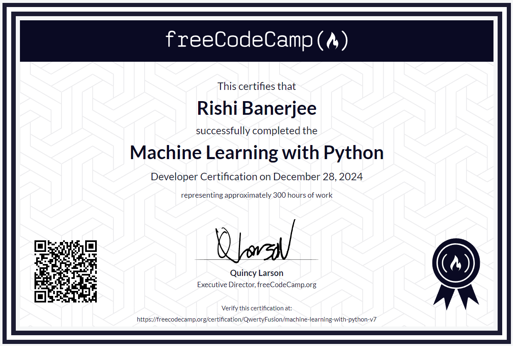

<h1>Free Code Camp - Machine Learning with Python Solution</h1>
 

  

  <h3><a href="https://www.freecodecamp.org/learn/machine-learning-with-python/#machine-learning-with-python-projects">Course Link</a></h3>

<h2>Certificate</h2>

  

  <h3><a href="https://www.freecodecamp.org/certification/QwertyFusion/machine-learning-with-python-v7">Certificate Link</a></h3>

<h2>Contents</h2>

| Assignment |	Solution |
| ---------- | --------- |
| [Rock Paper Scissors](https://www.freecodecamp.org/learn/machine-learning-with-python/machine-learning-with-python-projects/rock-paper-scissors) |	[Click here](./rock-paper-scissor-player) |
| [Cat and Dog Image Classifier](https://www.freecodecamp.org/learn/machine-learning-with-python/machine-learning-with-python-projects/cat-and-dog-image-classifier) |	[Click here](./cat-dog-image-classifier) |
| [Book Recommendation Engine using K](https://www.freecodecamp.org/learn/machine-learning-with-python/machine-learning-with-python-projects/book-recommendation-engine-using-knn) |	[Click here](./book-recommendation-knn) |
| [Linear Regression Health Costs Calculator](https://www.freecodecamp.org/learn/machine-learning-with-python/machine-learning-with-python-projects/linear-regression-health-costs-calculator) |	[Click here](./health-costs-prediction) |
| [Neural Network SMS Text Classifier](https://www.freecodecamp.org/learn/machine-learning-with-python/machine-learning-with-python-projects/neural-network-sms-text-classifier) |	[Click here](./sms-text-classification) |

<h2>Tools used</h2>
<ol>
  <li>Visual Studio Code</li>
  <li>Google Colab</li>
  <li>Jupyter Notebook</li>
  <li>Google Drive</li>
  <li>Python 3</li>
  <li>TensorFlow</li>
</ol>

<h2>Link to Tools</h2>

  &emsp;
  &emsp;
&emsp;
  &emsp;
  &emsp;
  &emsp;

<h2>Developer</h2>
<ul>
  <li><a href="https://github.com/QwertyFusion">[@QwertyFusion]</a></li>
</ul>
